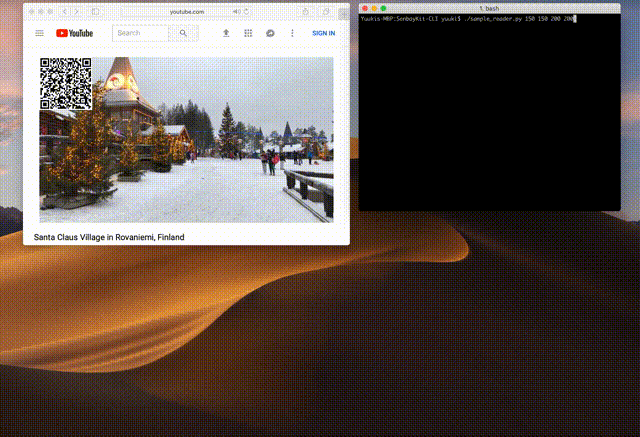

# Overview
**SenbayKit-CLI** is a package for encoding and decoding **SenbayVideo** on Command Line Interface (CLI) or in your Python program. SenbayVideo is a sensor-data embedded video. Each video frame on SenbayVideo contains sensor data as a QRcode. You can quickly save, share, and restream a video with sensor data by Senbay.

<p align="center">
    
</p>

## Environment
This package is constructed on Python, and depend on following external packages:
 * NumPy
 * OpenCV
 * fastzbarlight
 * qrcode
 * mss
 * six

This package is developed on macOS 10.12(Sierra), but you can use it on Windows and UNIX-based Operating Systems.

## Install

### Install dependance libraries
```command
pip install numpy
pip install opencv-python
pip install fastzbarlight
pip install qrcode
pip install mss
```

### Install **SenbayKit**
Download SenbayKit-CLI from GitHub and move to the home directory.
You can install `senbay` package by either `setup.py` or `pip`.

```command
python setup.py install
```

```command
pip install git+https://github.com/tetujin/SenbayKit-CLI
```

## How to use
### SenbayReader
**SenbayReader** is a module for decoding embedded sensor data from SenbayVideo.

#### CLI
Move to SenbayKit-CLI directory, and execute the following command with a path of a SenbayVideo.

```command
./sample_reader.py video_path
```

#### Python
For using the package in Python, You need to import `SenbayReader` module from `senbay` package. `SenbayReader` has three types of mode: video, camera, and screen. You can select mode for selecting the image input source at the `SenbayReader` initialization phase. The result is provided through a callback method which is set by you when executing `start` method.

On *Video Mode*, you can decode embedded data from a target SenbayVideo. The mode needs to set `mode='video'`(or `mode=0`) and `video_in='target_senbay_video'` when you initialize `SenbayReader`.

```python
# Video Mode
from senbay import SenbayReader

def showResult(self, data):
  print(data)

reader = SenbayReader(mode='video', video_in='path_to_senbay_video')
reader.start(showResult)
```

On *Camera and Screen Mode*, you can decode embedded data from camera input or on your screen. The *Camera Mode* needs to set `mode='camera'`(or `mode=1`) for getting video image from your connected camera. The *Screen Mode* needs to set `mode='screen'`(or `mode=2`) and `cap_area`(=capture area) when you initialize `SenbayReader`.

```python
# Camera Mode
from senbay import SenbayReader

def showResult(self, data):
    print(data)

reader = SenbayReader(mode='camera')
reader.start(showResult)
```

```python
# Screen Mode
from senbay import SenbayReader

cap_area = {'top':200, 'left':200, 'width':200, 'height':200}

def showResult(self, data):
    print(data)

reader = SenbayReader(mode='screen', cap_area=cap_area)
reader.start(showResult)
```

#### TODO
 - [x] Set SenbayReader configurations by options
 - [x] Test on Raspberry Pi
 - [ ] Test on Windows
 - [ ] Test on Ubuntu

### SenbayCamera
**SenbaCamera** allows us to embed sensor data as QRcode into each image frame which is input from a camera module on your computer, and export a SenbayVideo.

#### CLI
Download SenbayKit-CLI from GitHub and move to the directory. You can execute SenbayCamera by the following command.
 ```command
 ./sample_camera.py -o sample.m4v
 ```

Options to change video size, frame rate, and output path are as following.

 | Option | Default Value |
 | ---- | ---- |
 | -w --width        | 640 |
 | -h --height       | 360 |
 | -o --video-output | None |
 | -i --camera-input | 0  |
 | -r --fps          | 30 |
 | -s --stdout       | False |


#### Python
For using the package in Python, You need to import `SenbayCamera` module from `senbay` package. You can handle "QRcode generation," "frame generation," and "capture completion" events by through callback methods which are set when initializing a `SenbayCamera` instance.
Using `content_handler`, you can insert QRcode content into each video frame. In the method, you need to return a String object as a content of a QRcode. Inside SenbayCamera, a QRcode is generated based on the returned String object, and embedded into a video frame automatically. If you have interested in to use video frames, you can handle each video frame by `frame_handler`. The handler is called when SenbayCamera get a new video frame.

```python
from senbay import SenbayCamera

def content_handler():
  return "TIME:1234,ACCX:123"

def completion_handler():
  print("done")

def frame_handler(frame):
  # do something to the frame
  return frame

camera = SenbayCamera(video_output="sample.m4v",
                      content_handler=content_handler,
                      completion_handler=completion_handler,
                      frame_handler=frame_handler)
camera.start()
```

#### Live Streaming
[ffmpeg](https://www.ffmpeg.org/about.html) is a powerful tool for handling multimedia files. Using `ffmpeg` with `senbay` package, you can stream Senbay Video in the real-time via [Real-time Transport Protocol (RTP)](https://tools.ietf.org/html/rfc3550). Please check [sample_stream.sh](./sample_stream.sh) for more details. `--stdout` option provides a raw video frame to standard output. You can forward and use it on the other programs.

The following commands show an example for streaming Senbay Video via RTP using ffmpeg.

```shell
## Sender Command
./sample_camera.py --without-preview --stdout -w 640 -h 360 | \
ffmpeg \
	-f rawvideo -pixel_format bgr24 -video_size 640x360 -i - \
	-c:v libx264 -pix_fmt yuv420p -r 30 -g 60 -b:v 2500k \
	-f rtp rtp://localhost:8080 -sdp_file stream.sdp

## Receiver Command
ffplay -protocol_whitelist "file,udp,rtp" stream.sdp
```

#### TODO
 - [x] RTP Live Streaming with `ffmpeg`
 - [x] Support Python2.x
 - [x] Test on Raspberry Pi
 - [ ] Test on Windows
 - [ ] Test on Ubuntu
 - [ ] Support RTMP Liver Streaming (YouTube Live) function

### SenbayFormat
Generate a SenbayFormat data.

```python
from senbay import SenbayData

sd = SenbayData()
sd.add_number('KEY1',value1);
sd.add_text('KEY2','value2');
print(sd.encode());
```

### SenbayFormat
Parse a SenbayFormat data

```python
from senbay import SenbayData
sd = SenbayData()
senbayFormatText = 'V:3,TIME:123456,ACCX:1234,ACCY:56789';
dict = sd.decode(senbayFormatText);
print(dict)
```

## Author and Contributors
**SenbayKit-CLI** is authord by [Yuuki Nishiyama](http://www.yuukinishiyama.com). In addition, [Takuro Yonezawa](https://www.ht.sfc.keio.ac.jp/~takuro/), [Denzil Ferreira](http://www.oulu.fi/university/researcher/denzil-ferreira), [Anind K. Dey](http://www.cs.cmu.edu/~anind/), [Jin Nakazawa](https://keio.pure.elsevier.com/ja/persons/jin-nakazawa) are deeply contributing this project. Please see more detail information on our [website](http://www.senbay.info).

## Related Links
* [Senbay Platform Website](http://www.senbay.info)
* [Senbay YouTube Channel](https://www.youtube.com/channel/UCbnQUEc3KpE1M9auxwMh2dA/videos)

## Citation
Please cite these papers in your publications if it helps your research:

```
@inproceedings{Nishiyama:2018:SPI:3236112.3236154,
  author = {Nishiyama, Yuuki and Dey, Anind K. and Ferreira, Denzil and Yonezawa, Takuro and Nakazawa, Jin},
  title = {Senbay: A Platform for Instantly Capturing, Integrating, and Restreaming of Synchronized Multiple Sensor-data Stream},
  booktitle = {Proceedings of the 20th International Conference on Human-Computer Interaction with Mobile Devices and Services Adjunct},
  series = {MobileHCI '18},
  year = {2018},
  location = {Barcelona, Spain},
  publisher = {ACM},
}
```

## License

SenbayKit-CLI is available under the Apache License, Version 2.0 license. See the LICENSE file for more info.
